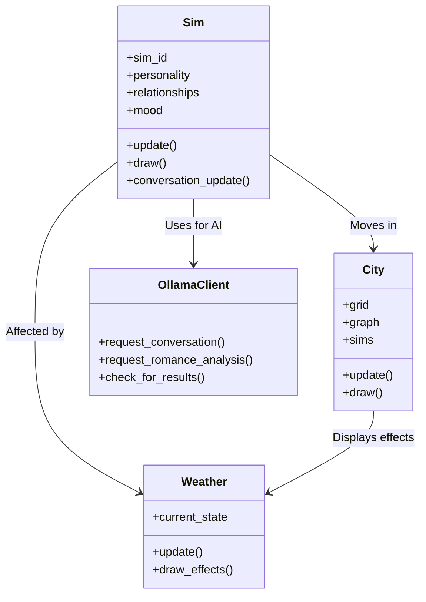

# AI Simulation Project Documentation

## Project Overview
A simulation game where AI-driven characters interact in a dynamic environment with:
- Character behaviors and relationships
- Environmental effects (weather)
- AI-driven conversations and romance analysis
- Visual representation with sprites and tiles

## Technology Stack
- **Core**: Python 3
- **Game Engine**: pygame-ce
- **UI Framework**: pygame_gui
- **AI Integration**: ollama
- **Data Analysis**: pandas, matplotlib
- **Pathfinding**: networkx
- **Configuration**: JSON-based config manager

## Class Diagram

## Key Functionalities

### 1. Character System (Sim)
- Personality traits and descriptions
- Mood system affected by weather
- Relationships (friendship/romance)
- Pathfinding and movement
- AI-driven conversations

### 2. Environment (City)
- Grid-based tile system
- Pathfinding graph
- Tile rendering with layers
- Sim management

### 3. Weather System
- Dynamic weather states
- Visual effects (rain, snow)
- Smooth transitions
- Mood impact on sims

### 4. AI Integration
- Asynchronous conversation generation
- Romance analysis
- Personality description generation
- Configurable prompt templates

## Configuration
Managed via config.json with sections for:
- Simulation parameters
- Weather settings
- AI model configuration
- UI theming
- Character attributes

## Data Flow
1. Main loop updates sims, city, weather
2. Sims interact via OllamaClient
3. Results processed and relationships updated
4. Visual representation updated