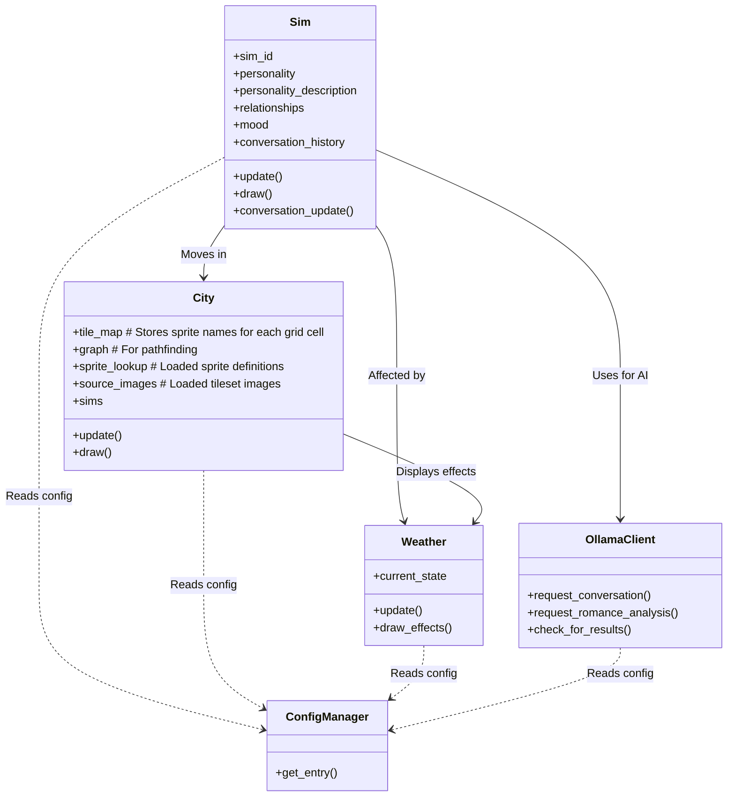

# AI Simulation Project Documentation

## Project Overview
A simulation game where AI-driven characters interact in a dynamic environment with:
- Character behaviors and relationships
- Environmental effects (weather)
- AI-driven conversations and romance analysis
- Visual representation with detailed, layered sprites using multiple tilesets
- Map generation based on configurable sprite definitions
- UI elements managed by `pygame_gui`

## Technology Stack
- **Core**: Python 3
- **Game Engine**: pygame-ce
- **UI Framework**: pygame_gui (Handles UI elements like Sim detail windows, labels, and conversation bubbles)
- **AI Integration**: ollama
- **Data Analysis**: pandas, matplotlib
- **Pathfinding**: networkx
- **Configuration**: JSON-based config manager

## Class Diagram

## Key Functionalities

### 1. Character System (Sim)
- Personality traits and descriptions (generated via Ollama, loaded/saved to file).
- Mood system affected by weather and interactions.
- Relationships (friendship/romance) updated based on interactions and AI analysis.
- Pathfinding and movement within the city grid, including collision avoidance.
- AI-driven conversations managed via `OllamaClient`.
- Conversation text displayed using `pygame_gui` labels.

### 2. Environment (City)
- Detailed map generation using sprites defined in `aisim/config/sprite_definitions.json` (for paths, props, water) and `aisim/config/sprite_grass.json` (for grass).
- Utilizes multiple tilesets for varied environments.
- Pathfinding graph (`networkx`) for character movement.
- Sprite rendering handles different dimensions and layering (e.g., props over grass).
- Sim management within the city environment.

### 3. Weather System
- Dynamic weather states (Sunny, Cloudy, Rainy, Snowy).
- Visual effects (rain, snow, screen tints).
- Smooth transitions between weather states.
- Mood impact on sims.

### 4. AI Integration (OllamaClient)
- Asynchronous conversation generation using threads.
- Asynchronous romance analysis based on conversation history.
- Personality description generation.
- Configurable prompt templates for different AI tasks.
- Manages concurrent requests to the Ollama API.

### 5. UI System (pygame_gui)
- Displays simulation status (speed, weather).
- Shows detailed Sim information (name, mood, personality, relationships, history) in interactive windows upon double-clicking a Sim.
- Renders conversation bubbles as `UILabel` elements positioned above Sims.

## Configuration
Managed via `config.json` with sections for:
- Simulation parameters (screen size, FPS, interaction distance, etc.)
- Weather settings (change frequency, colors, effects)
- AI model configuration (host, model, prompts, timeouts)
- UI theming (`aisim/config/theme.json`)
- Character attributes (`aisim/config/attributes.json`) used for personality generation.
- Sprite definitions (`aisim/config/sprite_definitions.json` and `aisim/config/sprite_grass.json`) for map visuals.

## Data Flow
1. Main loop initializes Pygame, `pygame_gui`, `ConfigManager`, `OllamaClient`, `City`, `Weather`, and `Sim` instances.
2. Main loop processes events (user input, GUI events).
3. Main loop updates `Sims`, `City`, `Weather`, and polls `OllamaClient` for results if not paused.
4. `Sim.update` calls `movement_update` and `conversation_update`.
5. `Sims` interact via `check_interactions`, potentially triggering `initiate_conversation`.
6. Conversations use `OllamaClient` to generate responses asynchronously.
7. `handle_ollama_response` processes AI results, updating Sim state and conversation history.
8. Romance analysis is requested via `OllamaClient` after conversations end.
9. Main loop draws `City`, `Sims`, `Weather` effects, and `pygame_gui` elements.

## Recent Refactoring
The codebase recently underwent refactoring to:
- Improve adherence to modern coding standards.
- Remove unused code (e.g., legacy panel drawing, custom text bubbles).
- Standardize logging using the `logging` module.
- Simplify code where possible.
- Consolidate UI display logic using the `pygame_gui` library.