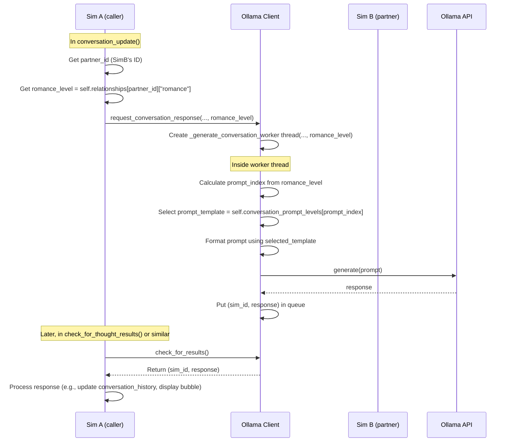

# Plan: Implement Relationship-Based Conversation Prompts

**Objective:** Modify the AI Sim conversation system to use different prompts based on the romantic relationship level between Sims.

**Phase 1: Configuration Update**

1.  **Modify `aisim/config/config.json`:**
    *   Remove the existing `conversation_prompt_template` key.
    *   Add a new key `conversation_prompt_levels` which will be an array (list) of 10 strings.
    *   Populate this list with placeholder prompts (e.g., "Placeholder Prompt - Level 1 [Shy]", ..., "Placeholder Prompt - Level 10 [Intimate]").

**Phase 2: Code Modifications**

1.  **Update `aisim/src/ai/ollama_client.py`:**
    *   **`__init__`:**
        *   Load `ollama.conversation_prompt_levels` into `self.conversation_prompt_levels`.
        *   Add validation to ensure it's a list with 10 elements.
    *   **`_generate_conversation_worker`:**
        *   Add a `romance_level: float` parameter.
        *   Implement logic to select the prompt index based on `romance_level` (0.0-0.09 -> index 0, ..., 0.9-1.0 -> index 9).
        *   Use the selected template for the prompt.
    *   **`request_conversation_response`:**
        *   Add a `romance_level: float` parameter.
        *   Pass `romance_level` when creating the `_generate_conversation_worker` thread.

2.  **Update `aisim/src/core/sim.py`:**
    *   **`conversation_update`:**
        *   In the call to `self.ollama_client.request_conversation_response`, retrieve the current Sim's `romance` level towards the partner from `self.relationships`.
        *   Pass the retrieved `romance_level` as an argument.

**Phase 3: Consideration**

*   **Relationship Dynamics:** The plan focuses on *using* the `romance` value. Additional code (outside this scope) is needed to *update* these values based on simulation events for the system to be dynamic.

**Visual Flow (Sequence Diagram):**

**Next Steps:** Implement the changes described above in Code mode.

---
